# 🌱 EcoTrack - Carbon Footprint Tracker App

## 📚 Table of Contents
1. [Overview](#overview)
2. [Architecture](#architecture)
3. [Authentication System](#authentication-system)
4. [Carbon Footprint Calculator](#carbon-footprint-calculator)
5. [AI Recommendations](#ai-recommendations)
6. [Gamification System](#gamification-system)
7. [Community Features](#community-features)
8. [Admin Panel](#admin-panel)
9. [API Integrations](#api-integrations)
10. [Development Setup](#development-setup)

## 🧭 Overview

EcoTrack is a comprehensive carbon footprint tracking application designed to help users measure, reduce, and offset their carbon emissions. The platform combines real-time carbon calculation, AI-powered recommendations, and community engagement to create an impactful environmental tracking solution.

### Core Features
- 🔐 Secure user authentication
- 📊 Real-time carbon footprint calculation
- 🤖 AI-powered reduction recommendations
- 🎮 Gamification elements
- 💬 Community forums
- 👨‍💼 Admin dashboard
- 🔌 External API integrations

## 🏗️ Architecture

### Tech Stack
- **Frontend**: 
  - React.js (Free, extensive documentation)
  - Vite (Fast, simple build tool)
  - Tailwind CSS (Utility-first CSS framework)
  - DaisyUI (Component library for Tailwind)

- **Backend**: 
  - Node.js with Express.js
  - MongoDB Atlas (Free tier available)
  - Mongoose (ODM for MongoDB)

- **Authentication**: 
  - Firebase Auth (Free tier available)
  - JWT for session management

- **Database**: 
  - MongoDB Atlas (Free tier: 512MB storage)
  - MongoDB Compass (GUI for database management)

- **Deployment**: 
  - Vercel (Free hosting for frontend)
  - Railway.app (Free tier for backend)
  - MongoDB Atlas (Free database hosting)

- **Development Tools**: 
  - VS Code (Free IDE)
  - Git & GitHub (Version control)
  - Postman (API testing)
  - MongoDB Compass (Database GUI)

- **External APIs**: 
  - OpenWeatherMap API (Free tier)
  - Google Maps API (Free tier)
  - Carbon Interface API (Free tier available)

### Why This Stack?
1. **Beginner Friendly**:
   - Extensive documentation available
   - Large community support
   - Many free learning resources
   - Simple setup process

2. **Cost Effective**:
   - All core technologies have free tiers
   - No upfront costs
   - Scalable as needed

3. **Easy to Learn**:
   - JavaScript/TypeScript throughout stack
   - Simple deployment process
   - Great developer experience
   - Modern tooling

4. **Production Ready**:
   - Industry standard technologies
   - Good performance
   - Reliable hosting options
   - Built-in security features

### System Design


## 🔐 Authentication System

### Implementation Details
- **Primary Auth Provider**: Firebase Auth
- **OAuth Support**: Google, Apple
- **Session Management**: JWT tokens
- **Security Measures**: 
  - Rate limiting
  - Password hashing
  - CSRF protection
  - Secure cookie handling

### User Data Structure
```json
{
  "user": {
    "id": "string",
    "email": "string",
    "name": "string",
    "profile": {
      "diet": "string",
      "transportation": "string[]",
      "homeEnergy": "string",
      "carbonGoal": "number"
    },
    "createdAt": "timestamp",
    "lastLogin": "timestamp"
  }
}
```

## 🧮 Carbon Footprint Calculator

### Activity Types
1. **Transportation**
   - Car (fuel type, distance)
   - Public transport
   - Bicycle
   - Flights

2. **Diet**
   - Food categories
   - Consumption frequency
   - Local vs imported

3. **Home Energy**
   - Electricity usage
   - Gas consumption
   - Water usage

### Calculation Flow

```mermaid
sequenceDiagram
    participant U as User
    participant B as Backend
    participant C as Carbon API
    participant D as Database
    
    U->>B: Submit Activity Data
    B->>C: Request Carbon Estimate
    C->>B: Return CO₂ Calculation
    B->>D: Store Activity
    B->>U: Display Results
```


### API Integration
- **Endpoint**: `POST /api/carbon/calculate`
- **Request Body**:
```json
{
  "activityType": "transport|diet|energy",
  "data": {
    "distance": "number",
    "fuelType": "string",
    "foodCategory": "string"
  }
}
```

## 🤖 AI Recommendations

### Implementation
- **Model**: GPT-4
- **Input**: User's carbon footprint data
- **Output**: Personalized reduction strategies

### Recommendation Categories
1. Transportation alternatives
2. Dietary changes
3. Energy-saving tips
4. Sustainable shopping
5. Carbon offset opportunities

## 🎮 Gamification System

### Features
- Achievement badges
- Carbon reduction challenges
- Leaderboard
- Progress tracking
- Reward system

### Data Structure
```json
{
  "achievements": {
    "id": "string",
    "name": "string",
    "description": "string",
    "points": "number",
    "icon": "string"
  }
}
```

## 💬 Community Features

### Components
- Discussion forums
- Success stories
- Group challenges
- Knowledge sharing
- Event organization

### Data Model
```json
{
  "post": {
    "id": "string",
    "author": "string",
    "content": "string",
    "likes": "number",
    "comments": "array",
    "tags": "string[]"
  }
}
```

## 👨‍💼 Admin Panel

### Features
- User management
- Content moderation
- Analytics dashboard
- System configuration
- API key management

### Access Control
- Role-based permissions
- Audit logging
- Activity monitoring

## 🔌 API Integrations

### External Services
1. **Climatiq API**
   - Carbon calculation
   - Emission factors
   - Real-time updates

2. **Carbon Interface API**
   - Transportation emissions
   - Energy consumption
   - Supply chain analysis

### Integration Flow


## 🛠️ Development Setup

### Prerequisites
- Node.js v18+
- MongoDB v6+
- Firebase project
- API keys for external services

### Installation
```bash
# Clone repository
git clone https://github.com/your-org/ecotrack.git

# Install dependencies
npm install

# Environment setup
cp .env.example .env
# Configure environment variables

# Start development server
npm run dev
```

### Testing
```bash
# Run unit tests
npm test

# Run integration tests
npm run test:integration

# Run e2e tests
npm run test:e2e
```

## 📝 Contributing

1. Fork the repository
2. Create a feature branch
3. Commit your changes
4. Push to the branch
5. Create a Pull Request

## 📄 License

MIT License - See LICENSE file for details

## 📁 Project Structure

```
ecotrack/
├── client/                    # Frontend React application
│   ├── public/               # Static files
│   │   ├── assets/          # Images, fonts, etc.
│   │   ├── src/
│   │   │   ├── auth/       # Authentication components
│   │   │   ├── dashboard/  # Dashboard components
│   │   │   ├── forms/      # Form components
│   │   │   └── ui/         # Basic UI components
│   │   ├── contexts/       # React contexts
│   │   ├── hooks/          # Custom React hooks
│   │   ├── pages/          # Page components
│   │   ├── services/       # API services
│   │   ├── styles/         # Global styles
│   │   ├── types/          # TypeScript types
│   │   ├── utils/          # Utility functions
│   │   ├── App.tsx
│   │   └── main.tsx
│   ├── package.json
│   └── vite.config.ts
│
├── server/                   # Backend Node.js application
│   ├── config/              # Configuration files
│   ├── controllers/         # Route controllers
│   ├── middleware/          # Custom middleware
│   ├── models/             # Database models
│   ├── routes/             # API routes
│   ├── services/           # Business logic
│   ├── utils/              # Utility functions
│   ├── app.js
│   └── server.js
│
├── docs/                    # Documentation
├── .env.example            # Environment variables template
├── .gitignore
└── README.md
```

## 🗄️ Database Schema

### Users Collection
```javascript
{
  _id: ObjectId,
  email: String,          // Unique, required
  password: String,       // Hashed
  name: String,          // Required
  profile: {
    avatar: String,      // URL to profile image
    bio: String,
    location: {
      city: String,
      country: String
    },
    preferences: {
      theme: String,     // 'light' | 'dark'
      notifications: Boolean
    }
  },
  carbonProfile: {
    diet: String,        // 'vegetarian' | 'vegan' | 'omnivore'
    transportation: [String], // ['car', 'public', 'bike']
    homeEnergy: String,  // 'electric' | 'gas' | 'mixed'
    carbonGoal: Number   // Monthly goal in kg
  },
  createdAt: Date,
  updatedAt: Date,
  lastLogin: Date
}
```

### Activities Collection
```javascript
{
  _id: ObjectId,
  userId: ObjectId,      // Reference to Users
  type: String,         // 'transport' | 'diet' | 'energy'
  category: String,     // e.g., 'car', 'flight', 'meat'
  data: {
    distance: Number,   // in km
    fuelType: String,   // for transport
    quantity: Number,   // for food/energy
    unit: String       // 'kg', 'kWh', etc.
  },
  carbonFootprint: Number, // in kg CO₂e
  date: Date,
  location: {
    latitude: Number,
    longitude: Number
  },
  notes: String
}
```

### Achievements Collection
```javascript
{
  _id: ObjectId,
  name: String,         // Unique
  description: String,
  criteria: {
    type: String,      // 'carbon_saved' | 'streak' | 'activity_count'
    threshold: Number
  },
  points: Number,
  icon: String,        // URL to achievement icon
  createdAt: Date
}
```

### UserAchievements Collection
```javascript
{
  _id: ObjectId,
  userId: ObjectId,     // Reference to Users
  achievementId: ObjectId, // Reference to Achievements
  progress: Number,     // Current progress towards achievement
  completed: Boolean,
  completedAt: Date,
  createdAt: Date
}
```

### Community Posts Collection
```javascript
{
  _id: ObjectId,
  userId: ObjectId,     // Reference to Users
  title: String,
  content: String,
  type: String,        // 'tip' | 'question' | 'success_story'
  tags: [String],
  likes: [ObjectId],   // Array of user IDs who liked
  comments: [{
    userId: ObjectId,
    content: String,
    createdAt: Date
  }],
  createdAt: Date,
  updatedAt: Date
}
```

### Carbon Goals Collection
```javascript
{
  _id: ObjectId,
  userId: ObjectId,     // Reference to Users
  target: Number,       // Target carbon footprint in kg
  period: String,       // 'monthly' | 'yearly'
  startDate: Date,
  endDate: Date,
  progress: Number,     // Current progress
  status: String,       // 'active' | 'completed' | 'failed'
  createdAt: Date,
  updatedAt: Date
}
```

### Indexes
```javascript
// Users Collection
db.users.createIndex({ email: 1 }, { unique: true })
db.users.createIndex({ "carbonProfile.diet": 1 })
db.users.createIndex({ createdAt: -1 })

// Activities Collection
db.activities.createIndex({ userId: 1, date: -1 })
db.activities.createIndex({ type: 1, date: -1 })
db.activities.createIndex({ "location": "2dsphere" })

// Community Posts Collection
db.posts.createIndex({ userId: 1, createdAt: -1 })
db.posts.createIndex({ tags: 1 })
db.posts.createIndex({ type: 1 })

// Carbon Goals Collection
db.goals.createIndex({ userId: 1, status: 1 })
db.goals.createIndex({ endDate: 1 })
```

### Relationships
1. **One-to-Many**:
   - User -> Activities
   - User -> Posts
   - User -> Goals
   - User -> UserAchievements

2. **Many-to-Many**:
   - Users -> Achievements (through UserAchievements)
   - Posts -> Users (through likes)

3. **Embedded Documents**:
   - User profile information
   - Post comments
   - Activity location data

### Data Validation
```javascript
// Example Mongoose Schema Validation
const userSchema = new mongoose.Schema({
  email: {
    type: String,
    required: true,
    unique: true,
    match: [/^\S+@\S+\.\S+$/, 'Please use a valid email address']
  },
  password: {
    type: String,
    required: true,
    minlength: 8
  },
  // ... other fields with validation
}, {
  timestamps: true
});
```
