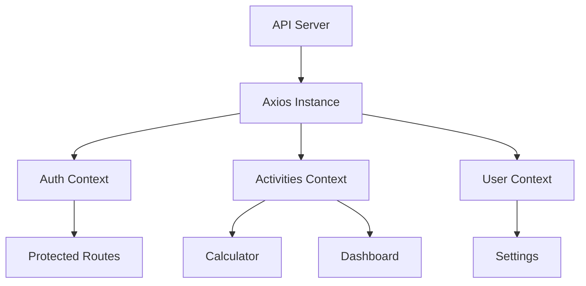

# 🌱 EcoTrack Frontend Documentation

## Table of Contents
- [Architecture Overview](#architecture-overview)
- [Page Structure](#page-structure)
- [Component Library](#component-library)
- [Design System](#design-system)
- [Data Flow Management](#data-flow-management)
- [Responsive Behavior](#responsive-behavior)
- [Development Guidelines](#development-guidelines)
- [Deployment Strategy](#deployment-strategy)

## Architecture Overview

### Tech Stack
- **Framework**: React.js with Vite
- **State Management**: React Context + Custom Hooks
- **Styling**: Tailwind CSS + DaisyUI
- **Routing**: React Router v6
- **Forms**: React Hook Form
- **API**: Axios with interceptors

### Key Architectural Decisions
- Component-Based Architecture
- Single Page Application (SPA)
- Context-based State Management
- Utility-First CSS Approach
- Client-Side Navigation
- Form Validation
- API Interceptors

## Page Structure

### 1. Landing Page (`/`)
**Purpose**: First impression and conversion funnel entry point

**Components**:
- Hero section with carbon visualization
- Value proposition columns
- Interactive calculator
- Testimonials
- CTA section

**Features**:
- Animated carbon footprint demo
- Newsletter signup
- Social proof stats

### 2. Authentication Pages

#### Login (`/auth/login`)
- Email/password form
- Social login options
- Password reset link
- Signup toggle

#### Signup (`/auth/signup`)
**Multi-step Form**:
1. Basic Information
   - Email
   - Password
2. Profile Setup
   - Name
   - Location
3. Carbon Preferences
   - Initial settings
   - Goals

#### Password Reset (`/auth/reset`)
- Email input
- Success/error states
- Login return link

### 3. Dashboard (`/dashboard`)
**Core Components**:
- Summary Cards
  - Current footprint
  - Period comparison
  - Goal progress
  - Achievements
- Activity Feed
- Carbon Trend Graph
- Quick Actions

### 4. Carbon Calculator (`/calculator`)
**Tabs**:
1. Transportation
   - Vehicle selection
   - Distance input
   - Fuel type
   - Public transport
   - Flight calculator

2. Diet
   - Food categories
   - Frequency input
   - Local/imported
   - Impact visualizer

3. Home Energy
   - Electricity usage
   - Heating type
   - Appliance ratings
   - Renewable energy

### 5. Activity Log (`/activities`)
**Features**:
- Filterable table
- Bulk actions
- Calendar heatmap
- Export options
- Category breakdown

### 6. Recommendations (`/recommendations`)
**Sections**:
- Priority Recommendations
- Personalized Tips
- Learning Hub

### 7. Goals & Challenges (`/goals`)
**Components**:
- Current Goals
- Suggested Challenges
- Achievements Gallery

### 8. Community (`/community`)
**Tabs**:
1. Discussion Forum
2. Success Stories
3. Local Groups

### 9. Offset Marketplace (`/offset`)
**Features**:
- Project carousel
- Impact calculator
- Portfolio tracker
- Certifications
- Recurring donations

### 10. Settings (`/settings`)
**Sections**:
- Profile
- Carbon Profile
- Security
- Advanced

## Component Library

### Core UI Components
1. **CarbonBadge**
   ```tsx
   interface CarbonBadgeProps {
     value: number;
     unit?: string;
     variant?: 'primary' | 'secondary';
     showTooltip?: boolean;
   }
   ```

2. **ActivityCard**
   ```tsx
   interface ActivityCardProps {
     activity: Activity;
     onEdit?: () => void;
     onDelete?: () => void;
   }
   ```

3. **ProgressRing**
   ```tsx
   interface ProgressRingProps {
     progress: number;
     size?: number;
     strokeWidth?: number;
     color?: string;
   }
   ```

### Complex Widgets
1. **CarbonTimeline**
   - Interactive visualization
   - Zoom/pan controls
   - Event markers
   - Comparison mode

2. **RecommendationEngine**
   - Dynamic suggestions
   - Implementation wizard
   - Impact projections

## Design System

### Colors
```css
:root {
  --primary: #2ECC71;
  --secondary: #3498DB;
  --accent: #E74C3C;
  --dark: #2C3E50;
  --light: #ECF0F1;
}
```

### Typography
```css
:root {
  --font-heading: 'Montserrat', sans-serif;
  --font-body: 'Open Sans', sans-serif;
  --font-code: 'Fira Code', monospace;
}
```

## Data Flow Management

### State Architecture



### Key Contexts
1. **AuthContext**
   - Session management
   - Authentication methods
   - Token handling

2. **UserContext**
   - Profile data
   - Preferences
   - Goals

3. **ActivitiesContext**
   - Activity management
   - CRUD operations
   - Data aggregation

## Responsive Design

### Breakpoints
```css
/* Mobile */
@media (max-width: 639px) { }

/* Tablet */
@media (min-width: 640px) and (max-width: 1023px) { }

/* Desktop */
@media (min-width: 1024px) { }
```

### Mobile Components
1. Bottom Navigation
2. Swipeable Cards
3. Contextual Actions

## Development Guidelines

### Component Structure
```
components/
  ComponentName/
    index.tsx
    types.ts
    styles.css
    test.tsx
    stories.tsx
```

### Best Practices
1. **Props Design**
   - Compound components
   - Controlled patterns
   - Default values

2. **Performance**
   - Memoization
   - Virtualization
   - Lazy loading

3. **Accessibility**
   - ARIA attributes
   - Keyboard nav
   - Color contrast

## Deployment

### Build Process
```bash
# Development
npm run dev

# Production
npm run build

# Testing
npm run test
```

### CI/CD Pipeline
1. Lint
2. Test
3. Build
4. Deploy
5. Audit 